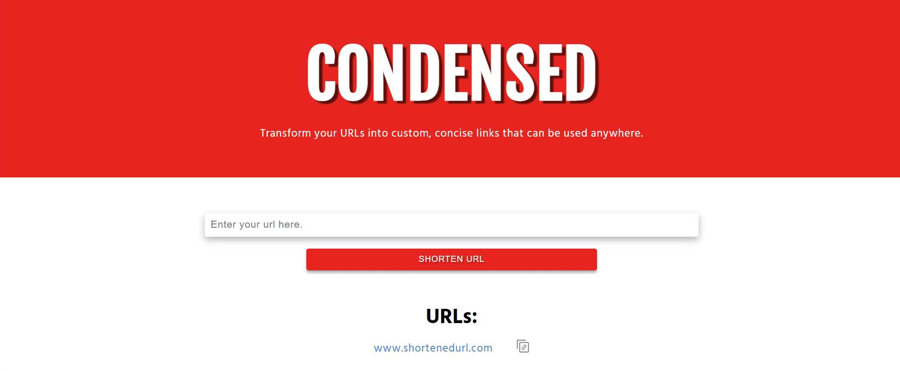

# CONDENSED - URL Shortener

  

## Live Demo

Find the live demo here: [www.hereistheurl.com](www.hereistheurl.com)

## Introduction

CONDENSED is a URL shortener that converts long URL links to shorter, more concise links.

## How it Works

The original URL is represented by a 7 digit slug. The slug is created with nanoid and a hexidecimal numbering system with base 16. There are 4.29 billion possible combinations for slug creation.

Original URLs and slugs are stored in the database. Before creating a new slug, the request body is validated to ensure it is a legitimate URL, and that it does not previously exist within the database. If the URL is found within the database, the existing slug is returned. Slugs are generated by nanoid and checked against the database to ensure each one is unique.

## How to Use

To create a shortened URL link, users can paste their original URL into the input box and click the SHORTEN URL button. The new URL will appear on screen and can be tested by clicking the link itself and copied by clicking the clipboard icon.

## Stack

- HTML & CSS
- JavaScript
- Node.js / Express
- MongoDB / Mongoose

## Usage

Suggestions, forks and pull requests are always welcome. Please give the project a star on GitLab if you are using the project.

## License

MIT License

Copyright (c) [2022] [Sarah Salvatore]

Permission is hereby granted, free of charge, to any person obtaining a copy
of this software and associated documentation files (the "Software"), to deal
in the Software without restriction, including without limitation the rights
to use, copy, modify, merge, publish, distribute, sublicense, and/or sell
copies of the Software, and to permit persons to whom the Software is
furnished to do so, subject to the following conditions:

The above copyright notice and this permission notice shall be included in all
copies or substantial portions of the Software.

THE SOFTWARE IS PROVIDED "AS IS", WITHOUT WARRANTY OF ANY KIND, EXPRESS OR
IMPLIED, INCLUDING BUT NOT LIMITED TO THE WARRANTIES OF MERCHANTABILITY,
FITNESS FOR A PARTICULAR PURPOSE AND NONINFRINGEMENT. IN NO EVENT SHALL THE
AUTHORS OR COPYRIGHT HOLDERS BE LIABLE FOR ANY CLAIM, DAMAGES OR OTHER
LIABILITY, WHETHER IN AN ACTION OF CONTRACT, TORT OR OTHERWISE, ARISING FROM,
OUT OF OR IN CONNECTION WITH THE SOFTWARE OR THE USE OR OTHER DEALINGS IN THE
SOFTWARE.

## Created By

Sarah Salvatore

- email: sarah.h.salvatore@gmail.com
- linkedin: [Sarah Salvatore](https://www.linkedin.com/in/sarah-salvatore-full-stack-developer/)
